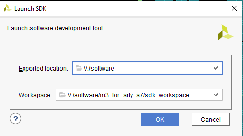
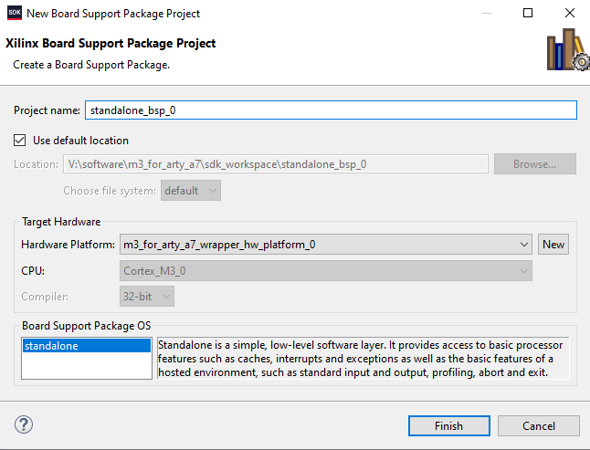
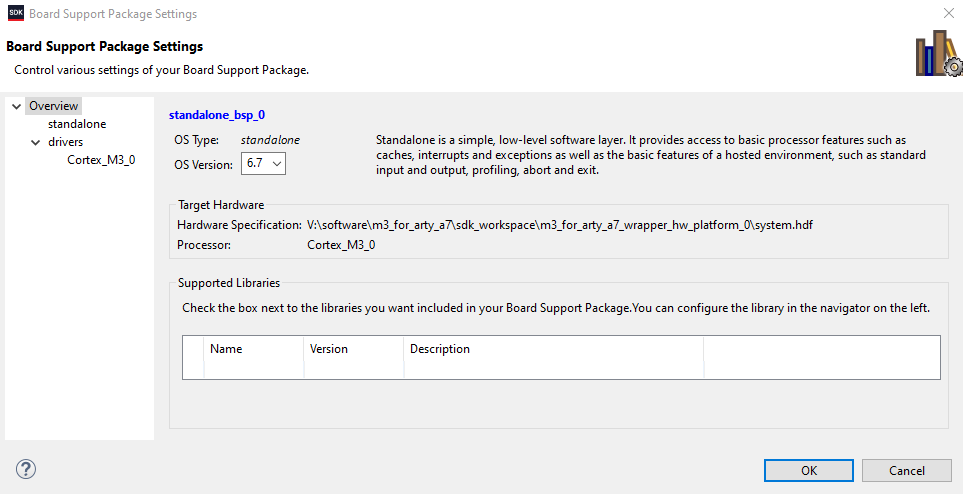
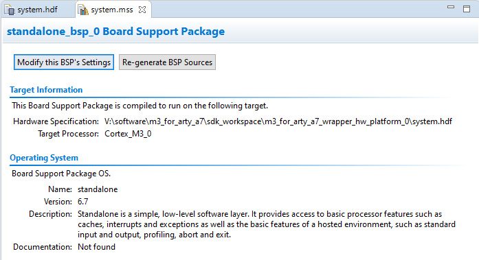
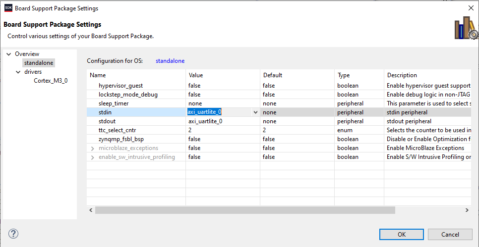

# Tutorial: How to program your Arty A7-35T with the ARM Cortex-M3 DesignStart example design

  

### Documentation:

Official User Guide: [Arm Cortex-M3 DesignStart FPGA-Xilinx edition User Guide](https://developer.arm.com/documentation/101483/0000/example-software-design/software-update-flow/generating-bit-and-flash-files)<br>

### Shoutouts:

Element14 Tutorials:<br>
[Getting up and running with Arm Design Start](https://www.element14.com/community/blogs/Exploring_the_Programmable_World/2018/11/19/getting-up-and-running-with-arm-design-start)<br>
 [Getting up and running with Arm Design Start, Generating the SW](https://www.element14.com/community/blogs/Exploring_the_Programmable_World/2018/12/19/getting-up-and-running-with-arm-design-start-generating-the-sw)<br>

  

### Prerequisite:
Register with http://www.xilinx.com, download and install Xilinx Vivado 2019.1

(This is the last major version before they began changing Vivado SDK to Vitis)

   
### Getting Prepared:
Download four files:

1. Digilent Board files from https://github.com/Digilent/vivado-boards/archive/master.zip
	- Decompress and copy the board files directories from inside
	C:\fpga\vivado-boards-master\new\board_files
	into
	C:\Xilinx\Vivado\2019.1\data\boards\board_files

2. ARM M3 - Cortex-M3 DesignStart FPGA Xilinx Edition:  https://developer.arm.com/ip-products/designstart
	- Decompress into C:\FPGA
	- Rename to ARM_Cortex_M3_2019.1
  
3. Micron flash memory model:  https://media-www.micron.com/-/media/client/global/documents/products/sim-model/nor-flash/serial/bfm/n25q/n25q128a13e_3v_micronxip_vg12,-d-,tar.gz?rev=0aafb8ea0b03403084d8967562251fd9
	- Extract the N25Q128A13E_VG12 directory, rename to Micron_N25Q128A13E
	- Move Micron_N25Q128A13E to C:\fpga\ARM_Cortex_M3_2019.1\hardware\m3_for_arty_a7\testbench
	- Copy file<br>
C:\fpga\ARM_Cortex_M3_2019.1\hardware\m3_for_arty_a7\testbench\Micron_N25Q128A13E\sim\sfdp.vmf<br>
	to<br>
	C:\fpga\ARM_Cortex_M3_2019.1\hardware\m3_for_arty_a7\testbench<br>

 4. Download Cypress flash memory model:  https://www.cypress.com/verilog/s25fl128s-verilog
	- It comes as a <number>.zip file, decompress to reveal S25fl128s.exe
	- Execute the installer, point it at C:\fpga\ARM_Cortex_M3_2019.1\hardware\m3_for_arty_a7\testbench
	- It should create directory C:\fpga\ARM_Cortex_M3_2019.1:\hardware\m3_for_arty_a7\testbench\S25fl128s

### Run Vivado 2019.1

Once open, run these TCL commands:
	```set_param board.repoPaths C:/fpga/ARM_Cortex_M3_2019.1/vivado/Digilent```<br>
	```cd C:/fpga/ARM_Cortex_M3_2019.1/```<br>
	```exec subst V: .```<br>

They tell Vivado the location of your board files and set up a virtual V: drive which points to your ARM Cortex directory. 

Select Tools->Settings->IP Defaults<br>
Add ```C:/fpga/ARM_Cortex_M3_2020.1/vivado/Arm_ipi_repository``` to Default IP Repository Search Paths

Select File->Open, select project file V:\hardware\m3_for_arty_a7\m3_for_arty_a7\m3_for_arty_a7.xpr<br>
If everything is set up properly, you should not see any error or warning popup messages.

Select options from the left-side Flow Navigator bar: 
-   Open Block Design
-   Run Synthesis
-   Run Implementation
-   Generate Bitsteam
-   Open Hardware Manager
-   Program device with generated bitstream V:\hardware\m3_for_arty_a7\m3_for_arty_a7\m3_for_arty_a7.runs\impl_1\m3_for_arty_a7_wrapper.bit

Flip the switches and press the buttons - LEDs changing means that default software is running on the M3 core and handling interrupts properly!


### Keil Software Flow:

#### Prerequisites:
Install ARM Keil v5:  https://developer.arm.com/ip-products/designstart

From Vivado, run these TCL commands to update the m3.mmi file:  
	```cd V:/hardware/m3_for_arty_a7/m3_for_arty_a7```<br>
	```source make_mmi_file.tcl```<br>
(any time you re-generate the bitstream you should re-run these steps)

- Select File->Export->Export Hardware, include bitstream
- Set "Exported location" to V:\software
- Set "Workspace" to V:/software/m3_for_arty_a7/sdk_workspace
- No need to include the bitstream file

Select File->Launch SDK:<br>


(Vivado SDK should open)

In SDK:
 - Select Xilinx->Repositories
- Make sure V:\vivado\Arm_sw_repository is listed under "Global Repositories"
- Create a Board Support Package:
- Select File->New->Board Support Package
- Leave everything as default and hit Finish:<br>


- Change the OS Version to 6.7
- Click OK, BSP will auto-build:<br>


- Open V:\software\m3_for_arty_a7\sdk_workspace\standalone_bsp_0\Cortex_M3_0\include\xparameters.h
- Look for STDIN_BASEADDRESS and STDOUT_BASEADDRESS
- *You won't find them, SDK is lying to you.*

- Close system.mss and re-open it, you should see Version 6.7 now:<br>


 - Click "Modify this BSP's Settings", go to "standalone" tab
 - Change Value column for stdin and stdout to be "axi_uartlite_0":<br>

 
 - Press "OK"<br>
 (SDK should automatically rebuild the project)<br>
 - Check xparameters.h - *now* you should see STDIN_BASEADDRESS and STDOUT_BASEADDRESS<br>
 - *(If you program the bitfile at the end of all this and the Arty is unresponsive, come back and check this again)*<br>

### Generating the ELF with Keil:

Copy files xpseudo_asm_rvct.c and xpseudo_asm_rvct.h<br>
from<br>
V:\vivado\Arm_sw_repository\CortexM\bsp\standalone_v6_7\src\arm\cortexm3\armcc<br>
to<br>
V:\software\m3_for_arty_a7\sdk_workspace\standalone_bsp_0\Cortex_M3_0\include<br>

- Go to V:\software\m3_for_arty_a7\Build_Keil<br>
- Double-click m3_for_arty_a7.uvprojx<br>
(This should run Keil and load the project)
  
- Select Project->Rebuild All Target Files<br>
- Open a CMD window<br>
- cd to v:\hardware\m3_for_arty_a7\m3_for_arty_a7<br>
- Run script make_prog_files.bat<br>
(This will run Vivado in the background and update the contents of the BRAM which contain your compiled Cortex application)<br>

### Re-program the Arty

- Go back to Vivado, select Hardware Manager
- Program V:\hardware\m3_for_arty_a7\m3_for_arty_a7\m3_for_arty_a7.bit

(If you have problems, you can program V:\hardware\m3_for_arty_a7\m3_for_arty_a7\m3_for_arty_a7_reference.bit to re-check the flow)

Now you should have the stock ARM M3 Cortex example design running with the compiled example software!

In the next tutorial we'll go through how to add our own ARM AXI slave device to the design with some additional custom RTL and add code to the Cortex application that accesses the new peripheral. 

Take Care!<br>
-Charley<br>
10/7/2020<br>


> Written with [StackEdit](https://stackedit.io/).